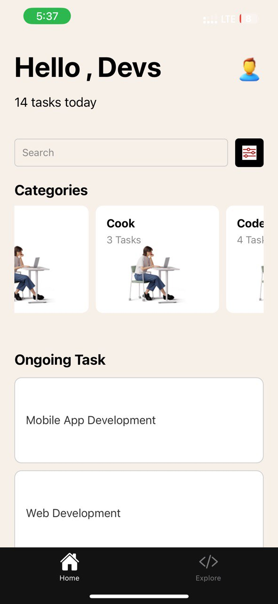

## 11327734

## Brief description of components used

I used a bunch of different components to build this app! I started with [View] to create containers for my layout. Then I used [Text] to display text, [StyleSheet] to style everything, and [TextInput] for the search bar. I made the filter button interactive with [TouchableOpacity] and displayed an image with [Image].

To show the categories, I used a [ScrollView] to allow horizontal scrolling and created individual category cards with View. I also used Text to display the category titles and task counts, and Image for the category icons.

For the ongoing tasks, I used another ScrollView to enable vertical scrolling and created task items with View. Finally, I used Text to display the task titles.

